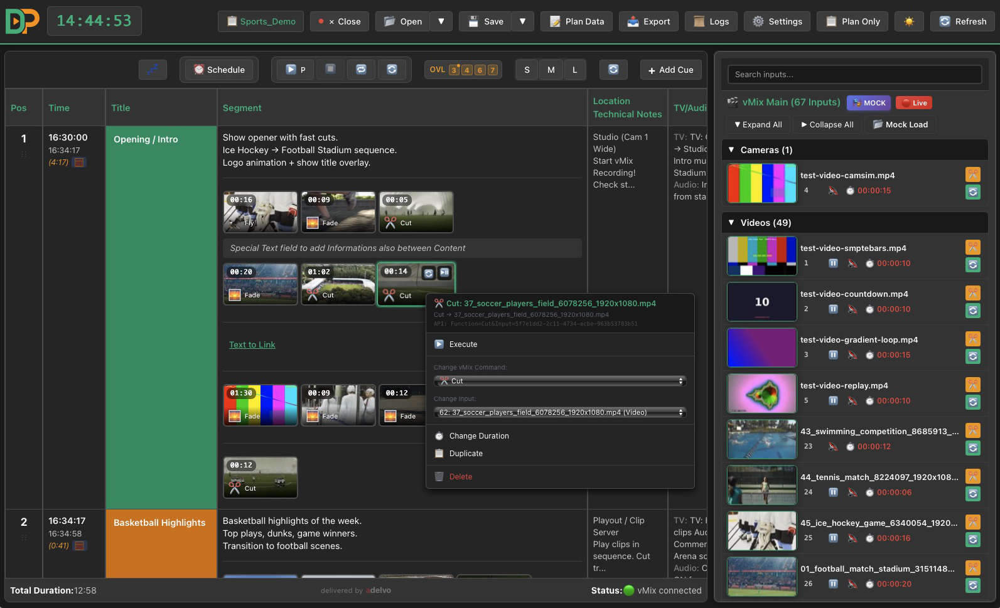
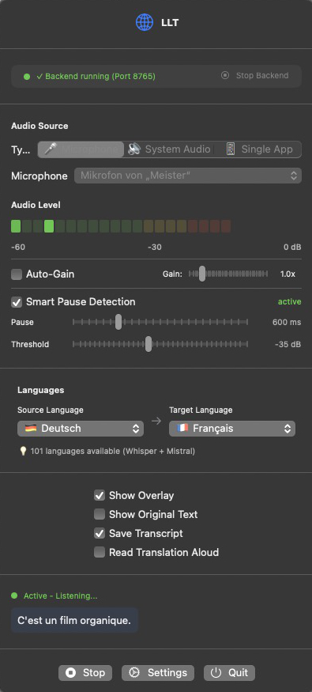
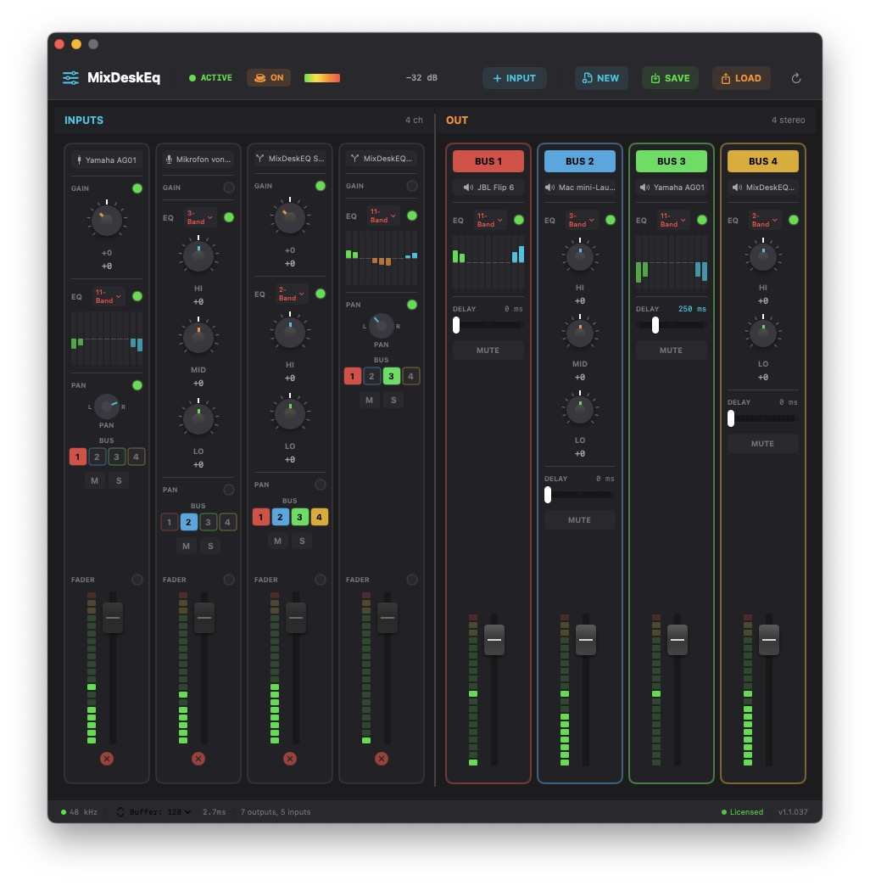
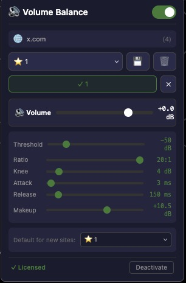
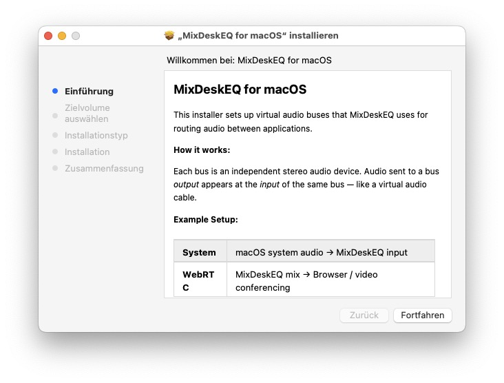

# Adelvo Software

**Professional software tools for live video production, audio routing, and media workflows.**

🌐 [adelvo.io](https://adelvo.io)

## Products

### 🎬 [Directors Plan](https://adelvo.io/directors-plan)  
Professional vMix control & automation software for live productions. Timeline-based rundown planning, drag & drop commands, Stream Deck / Companion export, 20+ languages. For churches, sports broadcasts, and corporate events.

### 🌍 [LLT — Local Live Translator](https://adelvo.io/local-live-translator)  
On-device LLM translation using Apple Silicon. App audio or microphone input with real-time overlay. 101 languages. Private, fast, no cloud dependency.

### 🎛️ [MDE — Mix Desk EQ](https://adelvo.io/mix-desk-eq) 
Professional audio routing & mixer for macOS. Capture individual app audio, mic, webcam, and line-in simultaneously. Up to 4 stereo outputs with 2/3/11-band EQ, delay compensation, and gain. 3 energy modes. Includes free BlackHole-based audio drivers.

### 🔊 [Volume Balance](https://adelvo.io/volume-balance) 
Browser extension that normalizes audio levels across all tabs. Audio compressor with threshold, ratio, knee, attack, release, and makeup gain. Chrome, Firefox, Safari.

## Free & Open Source Tools

### 🖼️ [DP Thumbnail Server](https://github.com/AdelvoInc/dp-thumbnail-server) 
Fast vMix input thumbnail generator. Supports all input types, key-based URLs, and auto-refresh web UI. [Download →](https://adelvo.io/directors-plan/#thumbnail-server)

### 🔌 [MDE Audio Drivers](https://github.com/AdelvoInc/mde-audio-drivers) 
Free virtual stereo audio devices for macOS — up to 8 independent BlackHole-based drivers. Standard .pkg installer with customizable components. GPL-3.0.

---

Adelvo Software · [adelvo.io](https://adelvo.io)
